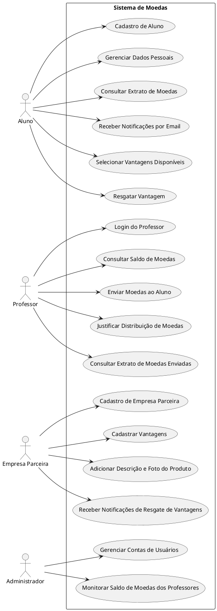

# Diagrama de Casos de Uso

Este diagrama mostra as interações entre os diferentes atores (Aluno, Professor, Empresa Parceira e Administrador) e o sistema de moedas. 

```plantuml
@startuml
left to right direction
skinparam packageStyle rectangle

actor "Aluno" as Aluno
actor "Professor" as Professor
actor "Empresa Parceira" as Empresa
actor "Administrador" as Admin

rectangle "Sistema de Moedas" {
    Aluno --> (Cadastro de Aluno)
    Aluno --> (Gerenciar Dados Pessoais)
    Aluno --> (Consultar Extrato de Moedas)
    Aluno --> (Receber Notificações por Email)
    Aluno --> (Selecionar Vantagens Disponíveis)
    Aluno --> (Resgatar Vantagem)

    Professor --> (Login do Professor)
    Professor --> (Consultar Saldo de Moedas)
    Professor --> (Enviar Moedas ao Aluno)
    Professor --> (Justificar Distribuição de Moedas)
    Professor --> (Consultar Extrato de Moedas Enviadas)

    Empresa --> (Cadastro de Empresa Parceira)
    Empresa --> (Cadastrar Vantagens)
    Empresa --> (Adicionar Descrição e Foto do Produto)
    Empresa --> (Receber Notificações de Resgate de Vantagens)

    Admin --> (Gerenciar Contas de Usuários)
    Admin --> (Monitorar Saldo de Moedas dos Professores)
}
@enduml

```